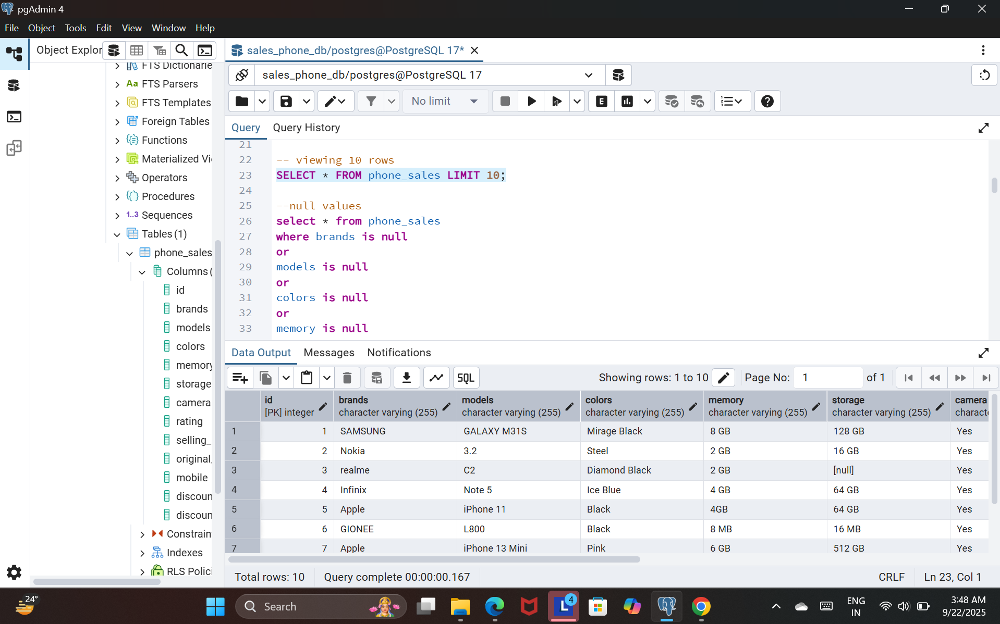

# Mobile_Mart_analytics

# 📊 MobileMart Analytics – Phone Sales SQL Project

This project analyzes mobile phone sales data using **PostgreSQL** inside **pgAdmin**.  
It is designed as a beginner-friendly SQL project but uses clean and professional queries.

---

## 📂 Dataset
- **File:** `Sales.csv`
- **Columns:** brands, models, colors, memory, storage, camera, rating, selling_price, original_price, mobile, discount, discount_percentage  
- Cleaned and imported into PostgreSQL using `COPY` command or pgAdmin Import Wizard.

---

## 🛠️ Tech Stack
- **Database:** PostgreSQL  
- **Tool:** pgAdmin 4  
- **Language:** SQL  

---

## 🧠 What I Practiced
✅ Basic SELECT and LIMIT  
✅ Aggregate Functions (SUM, COUNT, AVG)  
✅ GROUP BY and ORDER BY  
✅ CASE statements for price range grouping  
✅ Creating Views  
✅ Writing clean queries for insights  

---

